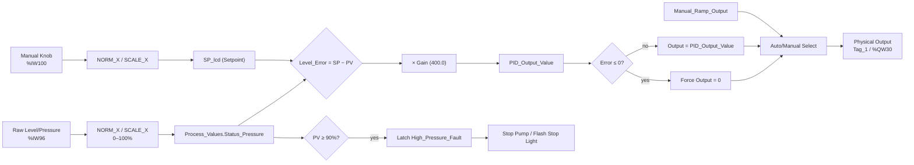

# Custom Proportional Level Control System
### TIA Portal (S7-1500) × Factory I/O

[](https://opensource.org/licenses/MIT)

-005CA9)


A ladder-logic (LAD) tank/pump control system built in Siemens TIA Portal, simulated against a **Factory I/O** 3D plant via **S7‑PLCSIM Advanced**. The controller reads a level/pressure transmitter, computes a proportional correction against an operator setpoint, and drives a fill process through a pump — with soft-start ramping, dry-run protection, high-level fault latching, and a manual/auto output mode switch.
<video src="https://github.com/rayenabid406/Automated_Pumping_Station-/releases/download/v1.0.0/factoryio.mp4" width="100%" autoplay loop muted playsinline></video>
## Overview

The PLC program (`Main [OB1]`) runs a single-pump fill/level loop:

1. **Signal conditioning** – raw analog inputs (level/pressure, flow, manual setpoint knob) are normalized and scaled into engineering units (0–100%).
2. **Protection interlocks** – a high-level/pressure fault latches the process off; a dry-run fault protects the pump from running without flow/suction.
3. **Pump sequencing** – seal-in start/stop logic with a 4-second soft-start ramp before the process output is allowed to track the controller.
4. **Proportional control** – a simple P-controller (`Error × Gain`) computes a correction between setpoint and process value, clamped to prevent reverse action.
5. **Manual/Auto output select** – the physical output can be driven either by a manual ramp/knob value or by the calculated proportional output.
6. **Factory I/O simulation** – all physical I/O maps 1:1 to a Factory I/O tank scene (fill valve, discharge valve, level gauge, pushbuttons, indicator lights) over the S7‑PLCSIM Advanced virtual Ethernet adapter.

---

## Control Logic (by network)

| Network | Function |
|---|---|
| 1–2 | `NORM_X` / `SCALE_X` — raw pressure/level input (`%IW96`, 0–27648) normalized then scaled to `Process_Values.Status_Pressure` (0–100%) |
| 3–4 | High-level/pressure fault: latches `High_Pressure_Fault` when process value ≥ 90%; cleared only by the reset button |
| 5 | Pump 1 seal-in start/stop logic — HMI start / stop button / suction valve confirmation, gated by high-pressure and dry-run interlocks |
| 6 | 4-second on-delay timer (`TON`) — sets `Ramp_Complete` after pump start (soft-start allowance) |
| 7 | Output source select — fixed ramp value while soft-starting, knob-driven value once ramped, forced to 0 when pump is stopped |
| 8–9 | `Dry_Run_Fault` reset on pump start and via manual reset button |
| 10 | `Reset_Light` indicator — lit while `Dry_Run_Fault` or `High_Pressure_Fault` is active |
| 11 | Setpoint conditioning — manual knob (`%IW100`) normalized/scaled to `SP_lcd` (0–100%) |
| 12 | `Stop light` indicator — flashes at 1 Hz on high-pressure fault |
| 13 | Auto/Manual switch — reset-button contact selects whether `Manual_Ramp_Output` or `PID_Output_Value` drives the physical output (`Tag_1`, `%QW30`) |
| 14 | Proportional math: `Level_Error = SP − PV`, `Raw_Math_Output = Level_Error × 400.0`, converted to `PID_Output_Value` |
| 15 | Reverse-action clamp — forces `PID_Output_Value` to 0 when `Level_Error ≤ 0` (process at/above setpoint) |

> **Why `NORM_X` and `SCALE_X` are separate blocks:** normalization converts the raw hardware count into pure 0.0–1.0 math, and scaling then converts that ratio into human engineering units. Keeping these as two discrete steps means the sensor can be swapped for a different range (e.g. a 10-bar transmitter replaced with a 50-bar one) without touching any hardware-facing code — only the `MAX` limit on the `SCALE_X` block needs to change.



---

## I/O Map

### Physical I/O

| Signal | Address | Type | Description |
|---|---|---|---|
| `AI_Raw_Line_Pressure` | `%IW96` | INT | Raw level/pressure transmitter input |
| `AI_Raw_Flow_Meter` | `%IW98` | INT | Raw flow meter input |
| `Knob` | `%IW100` | INT | Manual setpoint/output potentiometer |
| `DI_Suction_Valve_Open` | `%I2.0` | BOOL | Suction valve open confirmation |
| `Stop Button` | `%I2.1` | BOOL | Manual stop pushbutton |
| `DI_Pump2_Feedback` | `%I2.2` | BOOL | Pump 2 running feedback |
| `alarms.Reset_Button` | `%I2.3` | BOOL | Fault reset / auto-manual mode select |
| `DQ_Pump1_Start` | `%Q2.0` | BOOL | Pump 1 contactor output |
| `DQ_Pump2_Start` | `%Q2.1` | BOOL | Pump 2 contactor output |
| `Reset_Light` | `%Q0.1` | BOOL | Fault reset indicator lamp |
| `Stop light` | `%Q0.2` | BOOL | Stop/fault indicator lamp |
| `Tag_1` (final output) | `%QW30` | INT | Final analog output to Factory I/O fill valve |
| `SP_lcd` | `%QW34` | INT | Scaled setpoint (0–100) to Factory I/O display |
| `PV` | `%QW36` | INT | Process value to Factory I/O display |

### Internal Tags

| Tag | Address | Type | Description |
|---|---|---|---|
| `TMP_Normalized_Pressure` | `%MD20` | REAL | Normalized pressure (0.0–1.0) |
| `Process_Values.Status_Pressure` | `%MD30` | REAL | Scaled process value (0–100%) |
| `TMP_Normalized_SP` | `%MD35` | REAL | Normalized setpoint (0.0–1.0) |
| `Level_Error` | `%MD60` | REAL | Setpoint − process value |
| `Raw_Math_Output` | `%MD64` | REAL | Error × proportional gain |
| `Manual_Ramp_Output` | `%MW50` | INT | Manual-mode output value |
| `PID_Output_Value` | `%MW52` | INT | Calculated proportional output |
| `Dry_Run_Fault` | `%M10.0` | BOOL | Latched dry-run protection |
| `Ramp_Complete` | `%M40.0` | BOOL | Soft-start timer done flag |

---

## Hardware / Software Stack

- **PLC:** Siemens S7-1500, CPU 1511-1 PN (simulated via S7‑PLCSIM Advanced V4.0)
- **I/O modules:** DI 16×24VDC / DQ, AI 8×U/I HS
- **Engineering software:** Siemens TIA Portal V17 or higher
- **Simulator:** S7‑PLCSIM Advanced V4.0 (virtual PROFINET adapter)
- **Plant simulation:** Factory I/O (Ultimate or MH Edition, with Siemens driver support)

> **Distributed I/O Topology Note:** In a live plant deployment, the analog processing cards do not sit in the central control room rack. This system is designed around a Siemens **ET 200** distributed I/O architecture. The physical level sensor (`%IW96`) wires directly into an ET 200 analog input module located out in the field, right next to the tank. The ET 200 head module digitizes these values locally and transmits them over a single PROFINET line to the main S7-1500 CPU, significantly cutting down industrial copper cabling costs.

---

## Prerequisites

- Siemens **TIA Portal** (V17 or higher recommended)
- Siemens **S7‑PLCSIM** (for simulating the S7-1200/1500 controller)
- **Factory I/O** (Ultimate or MH Edition with Siemens licensing)

---

## Installation & Running Guide

### 1. Clone and restore the PLC project

```bash
git clone https://github.com/yourusername/your-repo-name.git
```

Open **TIA Portal** → **Project → Retrieve...** → browse to the cloned folder → select the compressed project archive (`.zap17` / `.zap18`) → choose a local directory to extract it.

### 2. Spin up the simulated PLC core

1. In the TIA Portal project tree, select the main PLC folder (e.g. `PLC_1`).
2. Click **Start Simulation** to launch S7‑PLCSIM.
3. In the download dialog, select your PG/PC interface type (typically **PN/IE**), click **Start Search**, and select the simulated PLC.
4. Click **Load**, choose **"Start modules after downloading"**, then **Finish**. The virtual CPU should show a green **RUN** light.

### 3. Configure and connect Factory I/O

1. Launch **Factory I/O** and open the tank-level scene (or the default Level Control sandbox scene).
2. Go to **File → Drivers** (or press `F4`).
3. Select **Siemens S7-PLCSIM** from the driver dropdown.
4. Click **Configuration** and confirm the CPU model matches your TIA Portal project (S7-1200 or S7-1500).
5. Verify the I/O mapping matches the table above, e.g.:
   - Level sensor input → `%IW96`
   - Fill valve output → `%QW34` (or your mapped analog output)
6. Click **Connect** — a green checkmark confirms the link is live.

### 4. Operate the plant

1. Switch to the Factory I/O window and press **Play** to start the physics simulation.
2. Use the physical control panel in the simulation:
   - Adjust the knob/slider to change the **Setpoint**.
   - Watch the proportional math scale the fill valve dynamically.
   - If the level exceeds the safety limit, the **High-Pressure Fault** latches — use the physical **Reset Button** (`%I2.3`) to clear it.

---

## Safety Interlocks

- **High-level/pressure fault:** latches at ≥ 90% process value; pump stops and stop light flashes at 1 Hz until reset.
- **Dry-run protection:** blocks/reset on pump cycling to avoid running the pump without confirmed suction/flow.
- **Reverse-action clamp:** proportional output is forced to zero once the process value reaches or exceeds setpoint, preventing the valve from being driven the wrong way.

---

## License

This project is licensed under the **MIT License**.
